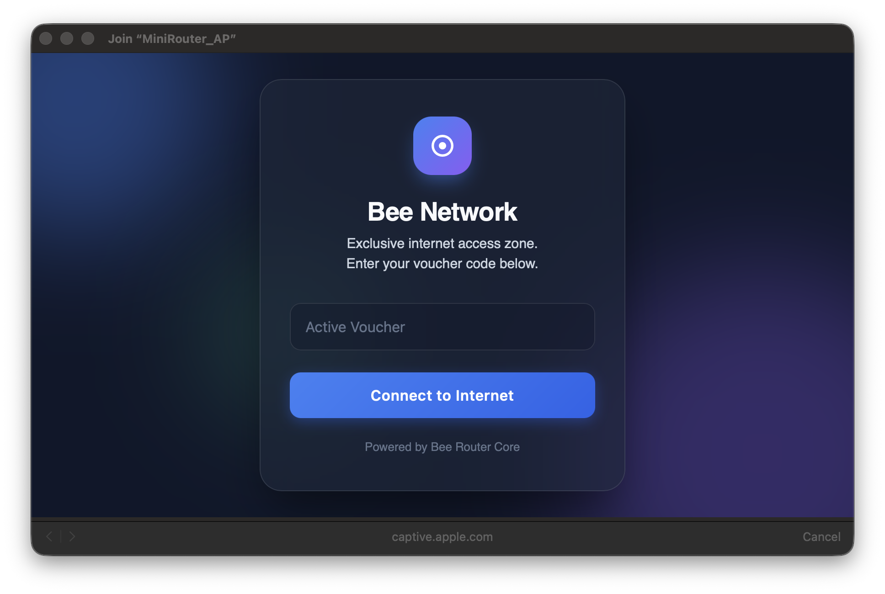
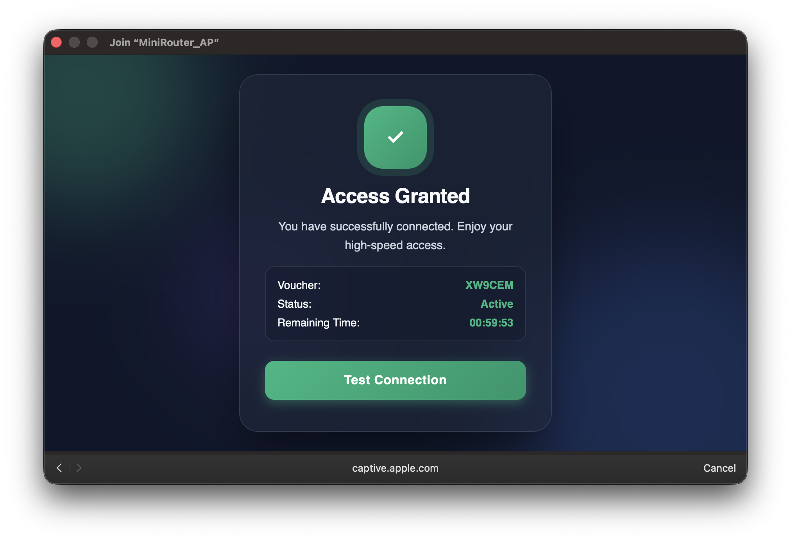
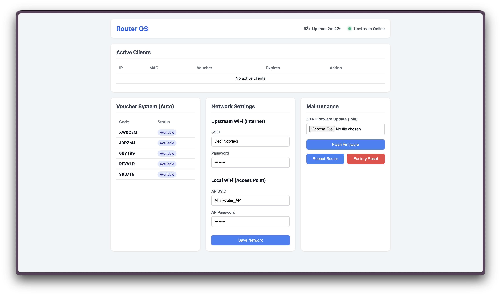
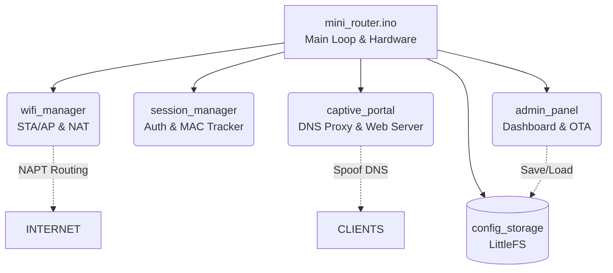

# ESP8266 Mini Router 🚀

A minimalist firmware solution for the ESP8266. It transforms an ESP8266 into a functional WiFi Repeater featuring a **Captive Portal**, **NAT/NAPT** routing, and **Smart DNS Proxy**, with a focus on memory efficiency and stable performance.

## 📸 Screenshots

  
  

  

---

- **Networking**:
  - **NAT/NAPT**: IP forwarding using LwIP v2.
  - **DNS Proxy**: Intercepts DNS queries for portal redirection.
  - **Dual Mode**: Connects to upstream WiFi while serving as an Access Point.
- **Access Control**:
  - **Vouchers**: Authentication using simple codes.
  - **MAC Binding**: Optional MAC address validation for sessions.
  - **Auto-Cleanup**: Automatically removes expired sessions.
- **Interfaces**:
  - **Captive Portal**: Web-based login page for clients.
  - **Admin Panel**: Dashboard for monitoring and network configuration.
- **🛠️ Technical Excellence**:
  - **Zero-Allocation Policy**: Eliminates usage of the `String` class and `malloc/new` on critical runtime paths.
  - **Persistent Storage**: Robust configuration management using LittleFS with reliable factory default fallback.
  - **OTA Updates**: Over-The-Air firmware upgrade support for easy maintenance.
  - **Hardware Integrity**: 5-second long-press hardware factory reset capability.

---

## 🏗️ Project Architecture

The codebase is modularized for maximum maintainability and clarity:

- `mini_router.ino`: Main entry point, core logic loops, and hardware interaction.
- `wifi_manager`: AP/STA initialization and NAPT/NAT configuration.
- `session_manager`: Authentication logic, session tracking, and MAC validation.
- `captive_portal`: DNS spoofing and premium web server implementation.
- `admin_panel`: Professional management interface for configuration and monitoring.
- `config_storage`: Filesystem interaction (LittleFS) for persistent data.

---

## ⚡ Getting Started

### Prerequisites
- **Hardware**: ESP8266 board (NodeMCU, Wemos D1 Mini, or similar).
- **Core Dependencies**:
  - `ESPAsyncWebServer`
  - `ESPAsyncTCP`
  - `LittleFS` (built-in to modern ESP8266 cores).

### Critical Configuration (Arduino IDE)
To enable NAT/NAPT functionality, you **MUST** select these settings before compiling:
1. **Tools** -> **lwIP Variant** -> **v2 Higher Bandwidth**
2. **Tools** -> **Flash Size** -> (Choose a size with at least 64KB LittleFS allocation).

#### 📦 How to generate the .bin file for OTA:
- **Arduino IDE**: Go to **Sketch** -> **Export Compiled Binary**. The `.bin` file will be generated in your project folder.
- **PlatformIO**: Run the **Build** task. The file will be located at `.pio/build/<env_name>/firmware.bin`.

---

## 🕹️ How to Use

1.  **Flash Firmware**: Upload the code with the correct LwIP variant settings.
2.  **Initial Connection**: Connect your device to the SSID **"MiniRouter_AP"** (Default Password: `12345678`).
3.  **Captive Portal**: Your device will automatically redirect to the login page. Enter an active voucher code.
4.  **Admin Dashboard**: Access the management panel at `http://192.168.4.1/admin`.
    - Username: `admin`
    - Default Password: `admin`
5.  **Reset**: Long-press the Flash (or dedicated) button for 5 seconds to wipe settings and restore defaults.

---

## 🔬 Technical Specifications

- **Networking Engine**: LwIP v2 (Higher Bandwidth variant).
- **DNS Protocol**: Proxy/Interceptor on UDP Port 53.
- **Data Persistence**: LittleFS Binary Storage.
- **Frontend**: PROGMEM-resident compressed HTML/CSS/JS.
- **Memory Integrity**: Static fixed-array session slot allocation.

---

## ⚠️ Known Limitations

- **Concurrent Sessions**: Limited to **5 sessions** to maintain stability and avoid memory crashes.
- **HTTPS Redirection**: Automatic portal detection works best on **HTTP**. HTTPS traffic redirection is limited by browser security/HSTS.
- **Hardware Performance**: Single-core CPU (80MHz/160MHz) and single radio mean limited throughput for heavy streaming.
- **Throughput**: Shared WiFi radio bandwidth between AP and STA mode (50% theoretical max).
- **Software NAT**: All routing is handled by software (LwIP), which increases CPU load during high traffic.

---

## 🛡️ License & Contributions

This project is licensed under the MIT License. Contributions are highly welcome! Feel free to submit Pull Requests or open issues for bug reports and feature requests.

---

> Authored by **Dedi Nopriadi**. 🚀
